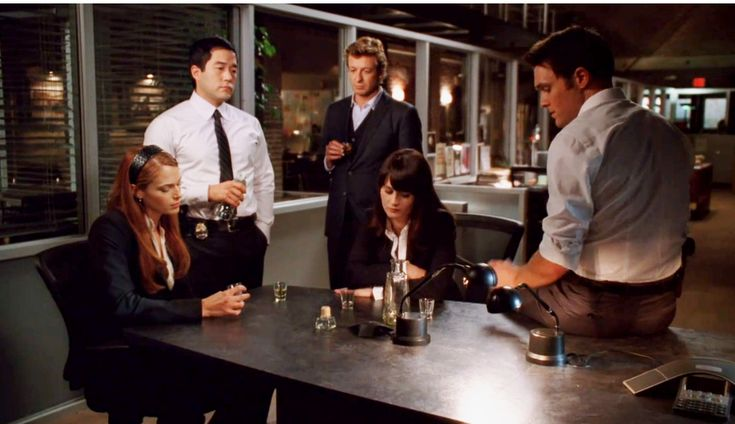
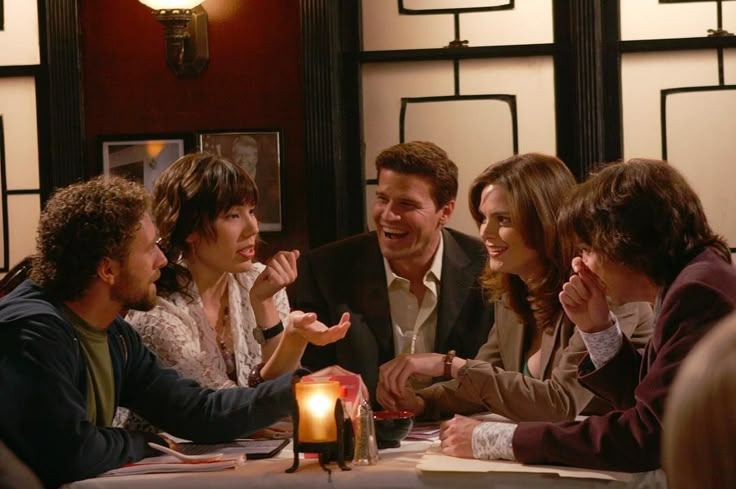

# El Mentalista

Voy a explicarte un poco el lore del mentalista:

El Mentalista es una serie de **misterio y crimen**, pero lo que la hace especial es su protagonista, Patrick Jane. No es policía ni detective, simplemente tiene una mente increíble: sabe observar, leer a la gente y usar la psicología para descubrir **cosas que los demás no notan.**

Ayuda a una unidad de crímenes a resolver casos, y cada capítulo tiene su propio misterio, pero también hay una **historia más profunda** detrás de él que le da mucho sentido a todo.

Lo mejor es cómo mezcla el **humor con momentos más serios**, y cómo el protagonista siempre logra salirse con la suya usando solo su ingenio. Es una serie inteligente, entretenida y con personajes que acaban gustándote un montón.

[Trailer de El Mentalista](https://www.youtube.com/embed/tCpWApgVqbc?si=j60xiYQXvE5qloBg)

Y un enlace para que vayas directo a verla, te la recomiendo muchísimo  :)
[Ve directo a verla](https://www.primevideo.com/detail/0JCAGVKV8JB0IM3RCVPIWENAMX/ref=atv_dp_share_cu_r)

# Bones

El lore de Bones es **parecido al del mentalista** pero un tanto diferente, ya que esta serie **no tiene a un vidente** y además está **basada en un libro**, que a la vez está basado en **hechos reales**. Cuenta la vida de la **Doctora Kathy Reichs**, pero poniendo como protagonista a la **Doctora Temperance Brennan**.

Igualmente es una serie de misterio y de crímenes, pero está más basada en la investigación forense. Los protagonistas trabajan en un laboratorio en Washington DC investigando crímenes para el FBI, en específico para el Agente Especial Seely Booth.

A lo largo de la serie se ve cómo Brennan y Booth forman un equipo increíble a pesar de ser completamente opuestos: ella es muy científica, lógica y algo fría, mientras que él es más emocional e intuitivo. Esa diferencia hace que choquen mucho al principio, pero con el tiempo se nota que se complementan a la perfección.

Lo que también me gusta mucho de Bones es el equipo del laboratorio, todos tienen su propia personalidad y aportan algo distinto. Entre los casos, las bromas y las relaciones entre ellos, acaban pareciendo una pequeña familia.

En general, es una serie que mezcla muy bien el misterio, la ciencia y el humor, con personajes que se hacen querer y evolucionan un montón con los años.

[Trailer Bones](https://www.youtube.com/embed/5KMszuAc8WQ?si=kyDmxsA0CrCxYncB)  
[A verla](https://www.primevideo.com/detail/0LCOF5TF2X23TJGP5C53AHIANW/ref=atv_dp_share_cu_r)

Ve directo a verla, eso sí, antes que El Mentalista y la otra serie que te voy a mencionar, así tendrás una mejor experiencia ;)

# Castle

Castle es otra de esas series que **me encantan**. Es de **misterio, crímenes y humor**, pero con una dinámica diferente al resto. Va sobre Richard Castle, un **escritor de novelas de misterio súper famoso** que empieza a colaborar con la policía de Nueva York después de inspirarse en un caso real para sus libros. Ahí conoce a la **detective Kate Beckett**, y juntos se convierten en un dúo increíble resolviendo casos.

Lo mejor de la serie es la química entre ellos. Castle es divertido, creativo y un poco caótico, mientras que Beckett es seria, profesional y muy inteligente. Se equilibran totalmente, y ver cómo trabajan juntos **entre bromas, teorías locas y momentos más intensos** es lo que hace que te enganches enseguida.

También me gusta que, aunque cada capítulo tiene su propio caso, hay una **historia más profunda** que se va desarrollando poco a poco, tanto en la parte personal como en la profesional. Tiene ese equilibrio perfecto entre misterio, humor y emoción que hace que no quieras dejar de verla.

Y bueno, Castle con su chaleco de “WRITER” es simplemente icónico.

[Trailer](https://www.youtube.com/embed/1CGTIrP1DqI?si=as6pL7-VzmYRdknX)  
[Disney +](https://www.disneyplus.com/es-es/browse/entity-30fb4e12-5a72-4fe6-85ff-ddb5e88d1a65)

---

Te dejo un enlace al otro archivo :)
[Sitcoms](Sitcoms.md)

