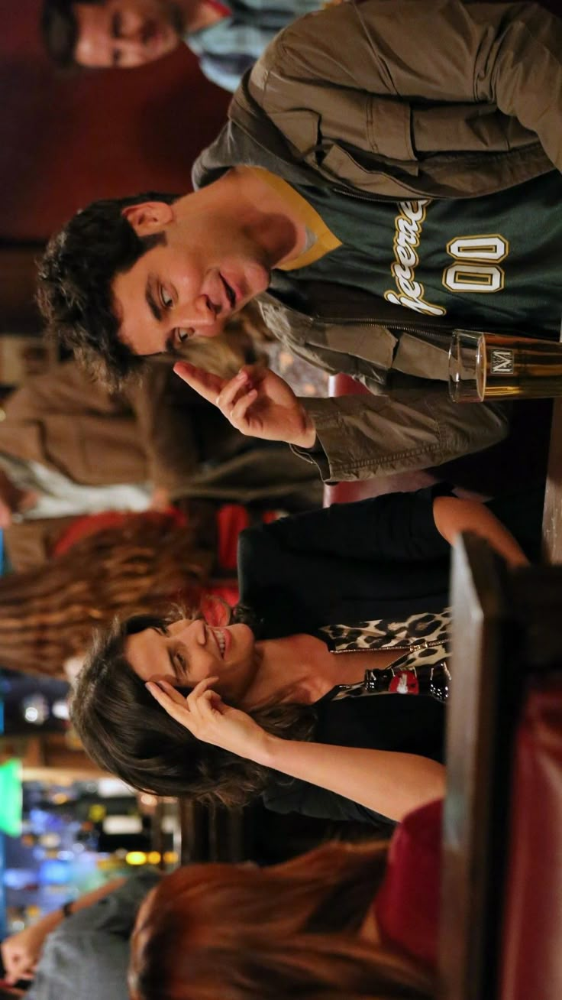
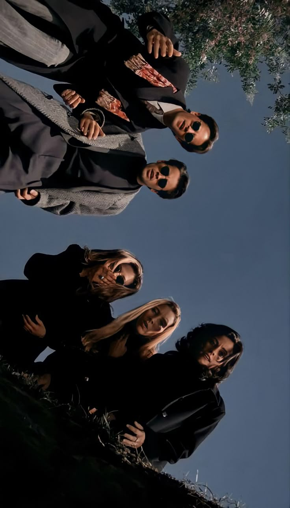
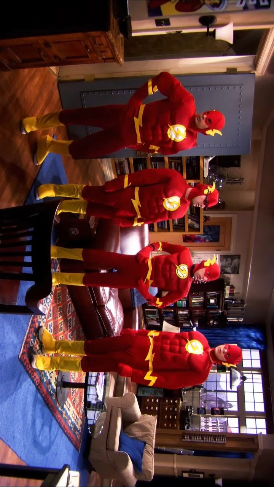

# How I Met Your Mother

*How I Met Your Mother* es una de **mis sitcoms favoritas**. Tiene ese toque especial que mezcla humor, amistad y momentos que de verdad te llegan. No es solo una comedia, también tiene una historia detrás que te engancha desde el primer capítulo.

Lo que **más me gusta** es cómo está contada, con saltos en el tiempo, anécdotas y una narración que hace que sientas que conoces a los personajes de toda la vida. Cada uno tiene su forma de ser, sus locuras y su propio encanto, y juntos crean algo único.

Te dejo un enlace al trailer de esta pedazo de sitcom:  
[Trailer](https://www.youtube.com/embed/cjJLEYMzpjc?si=MEVKxB0xqyr6jlbV)

Un clip interesante de HIMYM:  
[La Vie en Rose](https://www.youtube.com/embed/8Bw5Z0rBteY?si=NY9yms5VzO4qtiTb)

Un último video jeje:  
[La cabra](https://www.youtube.com/embed/d9u1ISvnG4k?si=YVR4-MQoyc8h5j_f)

---

# Friends

*Friends* es simplemente un **clásico**. Es de esas series que puedes ver una y otra vez y nunca aburrirte. Los seis protagonistas tienen una química increíble y las situaciones por las que pasan siempre te sacan una sonrisa, aunque ya las hayas visto mil veces.

Tiene un humor muy natural y un tipo de energía que pocas series logran. Y lo mejor es que, además de las risas, también tiene momentos emotivos que te recuerdan lo importante que es tener amigos que se vuelven tu familia.

[Trailer 1ª Temporada](https://www.youtube.com/embed/Zg2LCD5QOJs?si=KBdtjmx88TFhKbbO)

Te dejo un clipazo de esta sitcom, que de verdad, es el mejor clip que puede haber nunca:  
[El mejor clip de Friends](https://www.youtube.com/embed/GQWPpRBgkXw?si=eD3g_EJEWpYgaFkI)

---

# The Big Bang Theory

*The Big Bang Theory* me encanta por lo diferente que es. Tiene un **humor muy particular**, lleno de referencias a la ciencia, los cómics y la cultura geek. Los personajes son geniales, cada uno con su personalidad tan marcada y con una evolución muy buena a lo largo de los años.

Es una serie que combina perfectamente lo **divertido** con lo **tierno**, y que demuestra que ser diferente también puede ser lo que te hace especial. Además, tiene momentos que se vuelven inolvidables, sobre todo cuando ves lo mucho que cambian y crecen juntos.

[Trailer TBBT](https://www.youtube.com/embed/WBb3fojgW0Q?si=9e5sf-6jk1HanSBm)

---

# Opinión final

De todas estas sitcoms que te he hablado, si tuviera que elegir una sería *Cómo Conocí a Vuestra Madre (HIMYM)*. Para mí es una serie que me alegra siempre que lo necesito, con su carismático Barney, los líos de Ted, la vida de Marshall y Lily, la historia de cómo un niño pudo cambiar toda la vida de Barney, la corbata de patitos, *La Vie en Rose*, la historia de cómo conoció Ted a Robin, cómo Barney solo lleva traje, la historia de la cabra...

Hay tantas historias sobre esta serie que no sabría elegir una sola para contarte.

También es la última sitcom que he visto y la que más me ha gustado. Siempre he sido muy fan de *Friends*, pero una vez terminé esta serie completa, esta se lleva el primer puesto.

Si me preguntaras **¿Por qué?** yo te respondería que no sabría explicarte, porque la vida de estos cinco amigos y sus aventuras cada vez más locas me parece muy interesante, y sería una vida que, la verdad, si viviera en NY me gustaría tener con mis mejores amigas.

Por eso, si estás pensando en ver alguna, de verdad, tienes que ver—no tienes—**DEBES** ver *HIMYM*.  
Y esa es mi opinión final 🙂

Te dejo un enlace a una de las mejores canciones de la serie:  
[Mejor canción de la serie](https://www.youtube.com/embed/z_AgCzt9zcM?si=unWYkLjY4QgwGuhc)

---

Me encantaría pasarte los enlaces de donde vi estas series, pero *HIMYM* la descargué porque no la encontré en ninguna plataforma digital, y *Friends* y *The Big Bang Theory* las vi en la televisión 😉

                  
